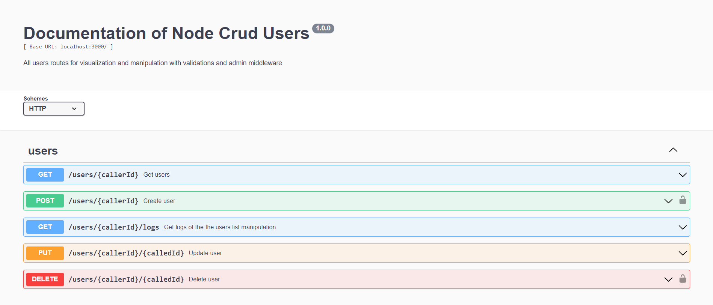

# Node Crud Users



## 💻 Project requirements

Make sure that npm and node are running and up to date. 

## 🚀 Installing project dependencies project for the first time

Open the folder of the project and run in the command prompt:

```sh
npm i
```
## ☕ Running the project

After all the project dependencies installed run in the command line:

```sh
npm start
```

This should appears on your terminal:

```sh
.
.
.
Server running on http://localhost:3000/
Docs running on http://localhost:3000/api-docs/#/
.
.
.
```

With the server running:

Take a look on the server routes documentation with examples included on [HERE](http://localhost:3000/api-docs/#/)
